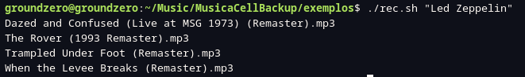

# 🎵 Buscar Músicas por Metadados

Script em Bash que utiliza o `ffprobe` para procurar arquivos de áudio no diretório atual cujo **título, artista ou álbum** contenham um termo específico.

Ideal para organizar grandes coleções de música com base em informações embutidas nos arquivos `.mp3`, `.flac`, `.m4a`, entre outros.

## ❓ Mas por que usar este script e não apenas `grep`?

O comando `grep` busca por texto em nomes de arquivos ou conteúdos visíveis. No entanto, muitas músicas baixadas de plataformas como **Seal**, **Snaptube** ou similares **não incluem informações do artista ou álbum no nome do arquivo** — apenas nos **metadados internos**.

Este script utiliza o `ffprobe` para ler esses metadados ocultos (como **título**, **artista** e **álbum**) diretamente do arquivo de áudio, permitindo que você encontre a música **mesmo que o nome do arquivo esteja genérico ou incompleto**.

> Exemplo:  
> Você baixou `Trampled Under Foot.mp3`, mas nos metadados o artista é `"Led Zeppelin"`  
> → `grep` não encontraria, mas este script encontra!


---



---

## 🛠️ Requisitos

- **Bash**
- **ffprobe** (parte do pacote `ffmpeg`)

Instale no Fedora, Ubuntu ou derivados:

```bash
sudo dnf install ffmpeg   # Fedora
sudo apt install ffmpeg   # Debian/Ubuntu
